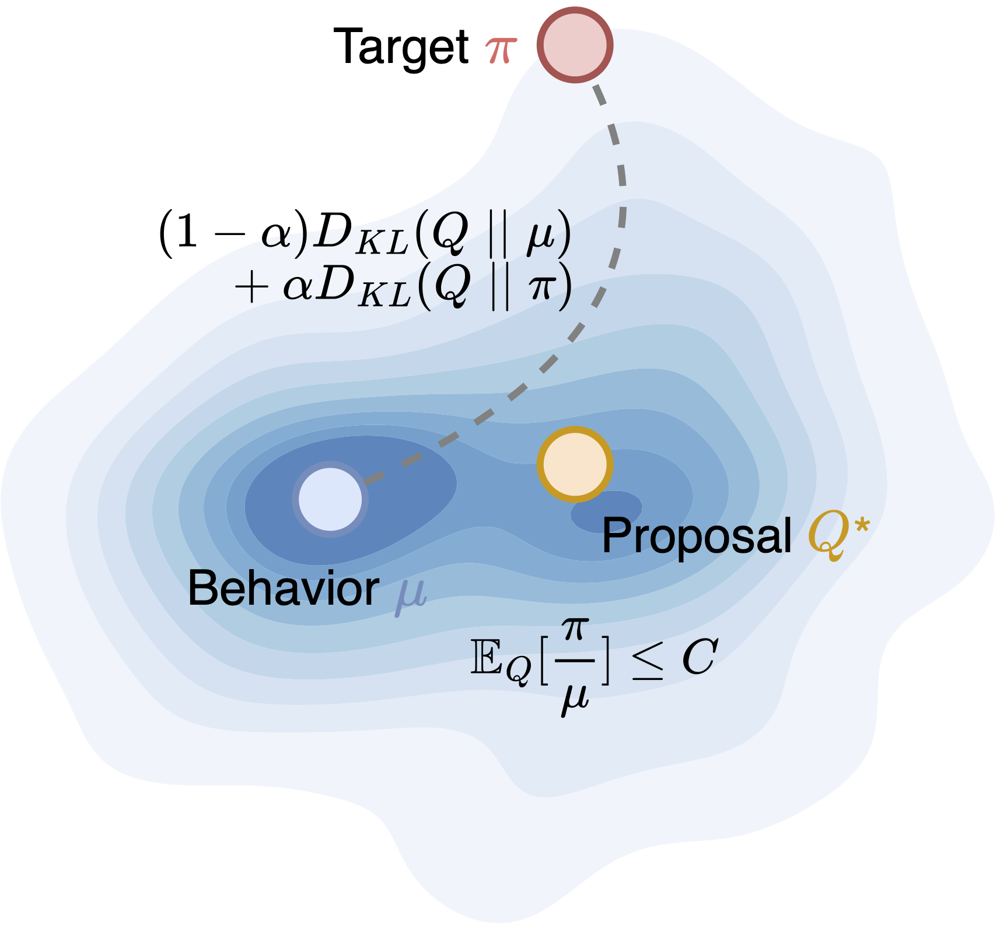
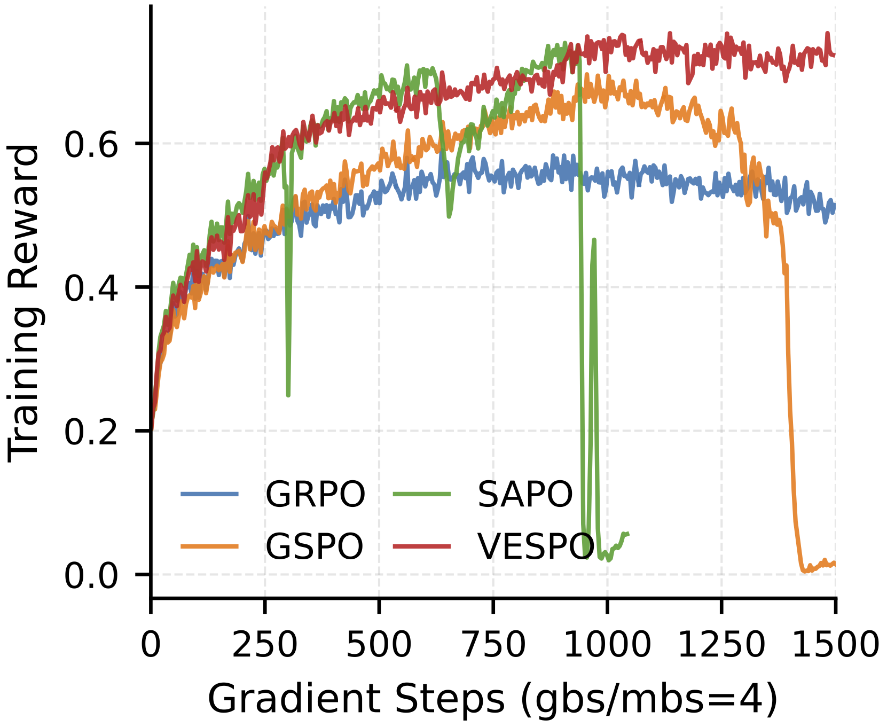
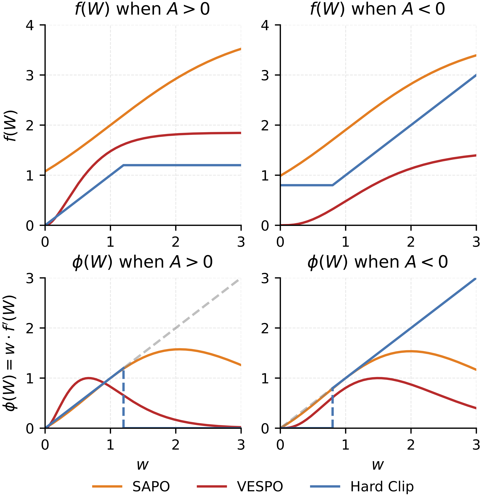
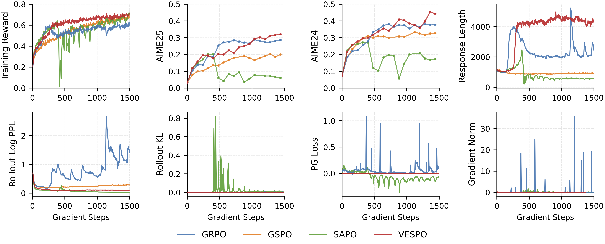

<div align="center">

# VESPO: Variational Sequence-level Soft Policy Optimization

[](https://arxiv.org/abs/xxxx.xxxxx)
[](https://github.com/xxxx/vespo)

</div>


## Overview

Off-policy updates are inevitable in RL for LLMs due to rollout staleness and training-inference mismatches. Prior remedies trade bias for variance via token-level clipping or sequence-level normalization, yet remain largely heuristic. VESPO incorporates variance reduction into a variational formulation and derives a closed-form reshaping kernel that operates directly on sequence-level importance weights without token-level approximation or length normalization.

<p align="center">
  
  &nbsp;&nbsp;&nbsp;&nbsp;
  
</p>

*The proposal Q\* balances proximity to both the behavior policy μ and the target π under an importance weight budget. **(Right)** Training reward with staleness N=4: VESPO remains stable while GRPO and SAPO collapse. VESPO scales to 64× staleness and fully asynchronous training without divergence.*

<p align="center">
  
</p>

*From a REINFORCE perspective, what matters is the effective coefficient on ∇log π, i.e., φ(W)=W·f'(W) (bottom row). VESPO's gamma-shaped kernel provides separate control over positive and negative advantages, offering more flexibility than hard clipping or fixed normalization.*

VESPO's robustness extends to fully asynchronous training, where rollout and training run on separate node groups with multi-step policy lag.

<p align="center">
  
</p>

## Code

The core VESPO policy loss is in [core_algos.py](recipe/vespo/code/core_algos.py). Training scripts are under [recipe/vespo/run/](recipe/vespo/run/).

## Reproduction

**1. Install** — follow the [veRL documentation](https://verl.readthedocs.io/en/latest/start/install.html) to set up the environment.

**2. Prepare data**

```bash
cd recipe/vespo/tools
python preprocess_datasets.py
```

**3. Train**

Edit the model and data paths in the script, then launch with a Ray cluster:

```bash
# Synchronous (N=8, 32 GPUs)
bash recipe/vespo/run/sync/vespo_N_8.sh

# Fully asynchronous (48 rollout + 16 train GPUs)
bash recipe/vespo/run/fully_async/vespo_S_1.0_N_4.sh
```

## Citation

If you find this work useful, please consider citing:

```bibtex
@article{vespo2026,
  title={VESPO: Variational Sequence-level Soft Policy Optimization},
  author={},
  journal={arXiv preprint arXiv:xxxx.xxxxx},
  year={2026}
}
```


This codebase is built on top of [veRL](https://github.com/volcengine/verl).
